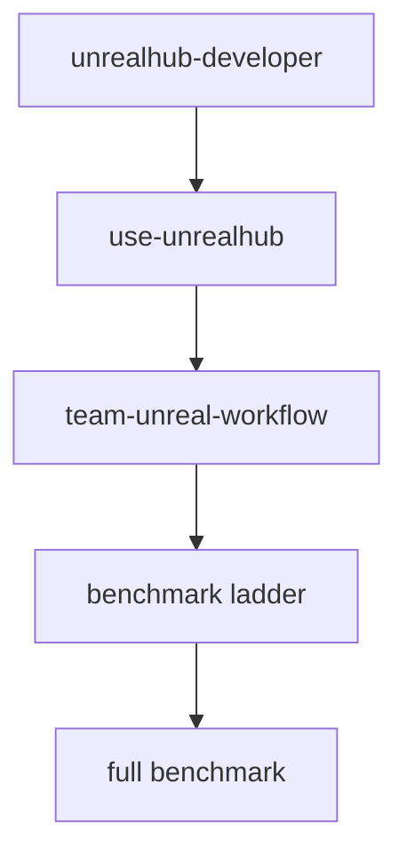

# Unreal AI Skill 结构 V2

## 目标

这版结构的目标不是再堆更多说明文档，而是把整个 fork 里的能力拆成更稳定的层级，让你后面可以同时满足：

- 日常项目协作
- 安全施工
- 分层 benchmark
- 长期魔改
- 未来可能的上游贡献

## 现有结构的问题

当前仓库原生只有三类 skill：

- `use-unrealhub`
- `ue-benchmark`
- `unrealhub-developer`

它们本身并不差，但有两个明显空档：

1. 缺少“项目层 wrapper skill”
2. 缺少“分层 benchmark 梯度”

结果就是：

- `use-unrealhub` 太偏运行层
- `ue-benchmark` 直接从重型场景切入
- 团队自己的 workflow、rules、试错报告没有真正挂到一个可触发 skill 上

## 新结构

## 分层定义

### 1. 维护层

Skill:
- [unrealhub-developer](C:\Users\alain\Documents\Playground\UnrealMCPHub\skills\unrealhub-developer\SKILL.md)

职责：
- 改 Hub 源码
- 增删工具
- 修 server 行为

### 2. 运行层

Skill:
- [use-unrealhub](C:\Users\alain\Documents\Playground\UnrealMCPHub\skills\use-unrealhub\SKILL.md)

职责：
- 项目配置
- 启动、编译、实例发现
- UE 代理调用

### 3. 项目层

Skill:
- [team-unreal-workflow](C:\Users\alain\Documents\Playground\UnrealMCPHub\skills\team-unreal-workflow\SKILL.md)

职责：
- 约束 AI 的默认行为
- 决定安全边界
- 选择 benchmark 阶段
- 提供任务模板和验收清单

这层是这次重构最重要的新增。

### 4. 评测层

Skill:
- [ue-benchmark](C:\Users\alain\Documents\Playground\UnrealMCPHub\skills\ue-benchmark\SKILL.md)

职责：
- 正式 benchmark 和评分

但现在不再把它当成唯一 benchmark 入口，而是让它下挂多级场景。

## Benchmark 梯度

新的 benchmark 建议分 4 级：

| 级别 | 场景 | 目的 |
|------|------|------|
| L0 | `smoke-connectivity-v1` | 验证整条链活着 |
| L1 | `sandbox-prototype-v1` | 验证 agent 可做安全小改动 |
| L2 | `cpp-gameplay-loop-v1` | 验证 agent 可做小型 C++ gameplay |
| L3 | `vampire-survivors-v1` | 正式重型 benchmark |

这样你后面做评测时，不会只有“全成”或“全挂”两种结果。

## 推荐编排

### 日常开发

优先使用：
- `team-unreal-workflow`
- `use-unrealhub`

### 研究试错

优先使用：
- `team-unreal-workflow`
- L0/L1/L2 benchmark 场景

### 正式评测

优先使用：
- `ue-benchmark`
- 对应 scenario

### Hub 魔改

优先使用：
- `unrealhub-developer`

## 你后面最值得继续补的东西

1. 团队 task templates 再丰富
2. benchmark-lite 的记录模板
3. review checklist 的结构化表格
4. benchmark 结果归档格式
5. 真正适合上游的通用改动再单独拆 PR
