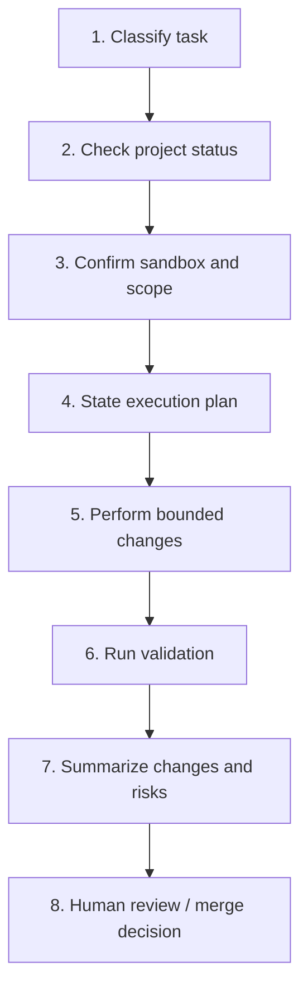

# Unreal AI Workflow

## Scope

This workflow is the project-facing wrapper around:

- [use-unrealhub](../../skills/use-unrealhub/SKILL.md)

Use it for daily Unreal development tasks performed by an AI agent through UnrealMCPHub or RemoteMCP.

## Default Objective

Build a repeatable Unreal workflow where AI can:

- inspect the project safely
- prototype inside a sandbox
- complete bounded tasks
- produce a reviewable change summary

**Do not treat this workflow as full autonomous production editing by default.**

---

## Working Mode Quick Reference

Choose the mode that matches the task before starting. Mode determines your default write scope.

| Mode | Write Scope | Requires Human Gate? |
|------|------------|----------------------|
| `advisory / read-only` | None — read only | No |
| `sandbox prototyping` | `__Sandbox/` and test map only | No |
| `restricted co-building` | One approved module or directory | Before starting |
| `workflow-node automation` | Approved pipeline paths | Before starting |
| `high-trust maintenance` | Broader project scope | Always required |

Default mode is `sandbox prototyping` unless the task explicitly states otherwise.

---

## Standard Task Loop



---

## Execution Steps

### 1. Classify Task

Before doing anything, classify the task into one of:

- `read-only` — analysis, log review, design planning
- `sandbox prototype` — new asset or Blueprint in sandbox path
- `restricted edit` — bounded change in one approved area
- `benchmark` — structured capture and evidence run
- `maintenance / inspection` — health check, status audit

If the task is ambiguous, default to `read-only` until scope is confirmed.

### 2. Check Project Status

Before editing, verify:

- project path is configured
- editor status is known
- active Unreal instance is correct
- required tools are available

Typical tools:

```
get_project_config
hub_status
discover_instances
manage_instance
ue_status
ue_list_domains
```

When the task depends on newer editor-side structured tools, also confirm:

- whether the active `RemoteMCP` build includes the required P0/P0.5 baseline
- whether the task would trigger a `session-disrupting` operation (e.g., map load/unload)
- whether the client is prepared to reconnect after those operations

### 3. Confirm Sandbox And Scope

Before any write action, define:

- allowed target directory
- allowed map
- whether the task is read-only, prototype, or restricted-edit
- whether C++ edits are in scope

Default assumption: **write only in sandbox content unless the task explicitly grants more scope.**

Hard stops — escalate to human review before proceeding if any of these are required:

- editing outside sandbox
- modifying shared assets or base blueprints
- changing production maps
- modifying project settings, plugins, or build config
- C++ module changes

### 4. State Execution Plan

Before any edits, the agent must state:

- what it will create or modify (with target paths)
- what it will **not** touch
- how it will verify success
- what the fallback is if validation fails

Do not start edits until the plan is stated.

### 5. Perform Bounded Changes

Preferred order:

1. Read current state
2. Create new assets or code in allowed paths
3. Avoid destructive edits — prefer additive work
4. Keep changes small and individually reviewable

**Preferred tool order:**

1. Use structured editor-side tools first (P0/P0.5 baseline tools)
2. Use `ue_call_dispatch` / `ue_call` next
3. Use `ue_run_python` only when no stable structured tool path exists yet

Avoid long chained Python editor scripts. Treat them as a fallback, not the default.

### 6. Run Validation

After each task unit, validate at the smallest useful level:

| Check | When Required |
|-------|--------------|
| Blueprint compile state | Any Blueprint change |
| Map loadability | Any map or level change |
| PIE start and stop | Any gameplay-affecting change |
| Asset existence | Any asset creation |
| Relevant logs | All tasks |
| Changed reference audit | Any shared asset touched |

**Minimum validation set for any task:**

- one before/after comparison or asset existence check
- one execution or compile log excerpt
- one risk note
- one readiness conclusion

**After a `session-disrupting` map operation, always reconnect first:**

```
ping
get_editor_state
get_current_level
```

Then re-verify before continuing.

### 7. Summarize Changes And Risks

Every task must end with a structured summary. Do not treat the task as done without it.

Required fields:

- **Changed files or assets** — with paths
- **Tools used** — tool names in order
- **Validation performed** — what was checked and the result
- **Unresolved risks** — what was not verified or may break
- **Recommended next step** — what a human reviewer should do next

### 8. Human Review And Merge Decision

Human review is **mandatory** before merging when:

- edits occurred outside sandbox
- any shared asset was changed
- any map was modified
- any project setting was changed
- any C++ module was changed

---

## Working Mode Details

### Advisory / Read-Only

Use for: project analysis, log debugging, design planning.

Allowed: status checks, tool listing, reading Unreal state.

Not allowed: any write operation.

### Sandbox Prototype

Use for: new blueprints, test widgets, level experiments.

Allowed: create under `/Game/__Sandbox/`, work in a test map, use PIE for local validation.

Not allowed: modifying anything outside the sandbox root.

### Restricted Build

Use for: one approved feature area, one bounded directory, one branch or task.

Allowed: edits inside the approved module or content path only.

Requires: explicit scope definition before starting.

### Benchmark

Use only when: environment is stable, sandbox process is understood, scoring matters.

See: [ue-benchmark](../../skills/ue-benchmark/SKILL.md)

### High-Trust Maintenance

Use only when: task is explicitly scoped, human has approved, scope is bounded and documented.

Not a default mode. Should be rare and always paired with explicit approval.

---

## Failure Handling

If validation fails:

1. **Stop.** Do not broaden scope or retry the same destructive operation without a new plan.
2. **Gather evidence** — collect logs, screenshots, or error output.
3. **Summarize the failure** — what was tried, what failed, what the error says.
4. **Propose the smallest corrective step** — targeted fix, not a broader retry.

**Failure taxonomy:**

| Type | Description | Default Response |
|------|-------------|-----------------|
| `connectivity` | Hub or RemoteMCP unreachable | Reconnect, check instance status |
| `compile failure` | Blueprint or C++ compile error | Gather error log, isolate change |
| `tool unavailable` | Required domain or tool missing | Check RemoteMCP version / P0 baseline |
| `session disruption` | Map operation broke connection | Reconnect via ping + get_editor_state |
| `validation gap` | Evidence missing, result unconfirmable | Re-run validation, do not mark complete |
| `scope violation` | Operation required leaving approved path | Stop, escalate to human |

---

## Exit Criteria For A Successful Task

A task is complete **only** when all four are true:

1. ✅ The intended change exists in the approved scope
2. ✅ Validation has been run and results recorded
3. ✅ No forbidden area was touched
4. ✅ The result is summarized in a reviewable way

If any of these are missing, the task is **incomplete** — even if the feature mostly works.
